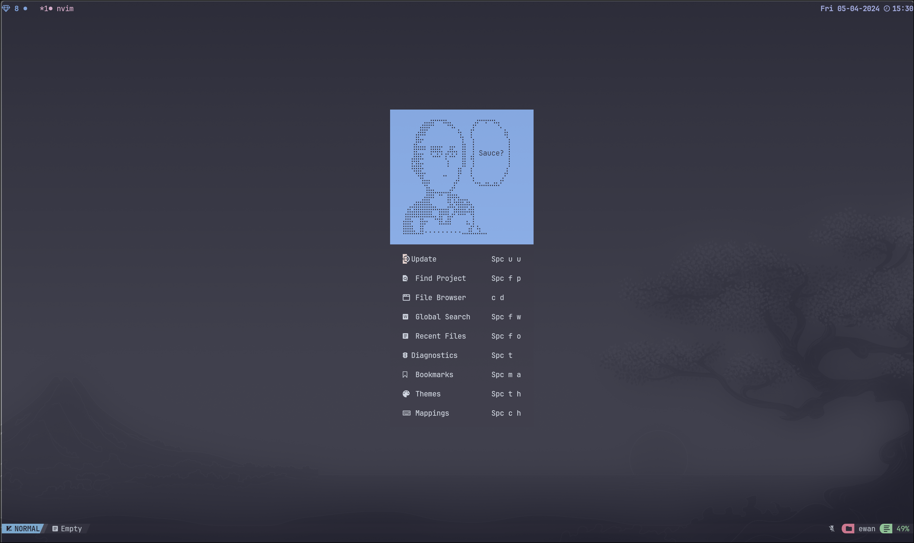
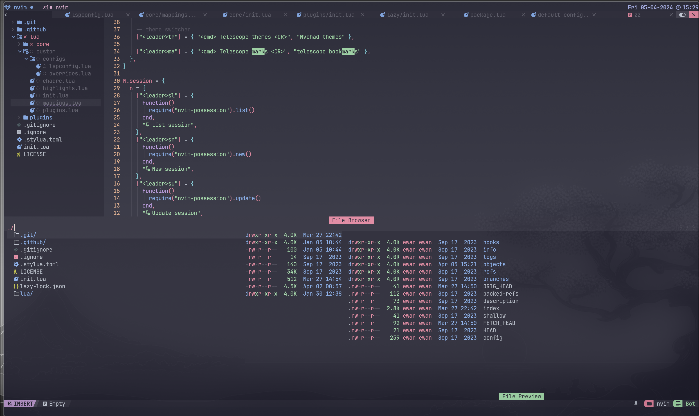

# My Neovim config

## plugins

`"williamboman/mason.nvim"` lsp quick install

`"neovim/nvim-lspconfig"` config for lsp

`"danymat/neogen",` code doc generation

`"iamcco/markdown-preview.nvim",`

`"lambdalisue/suda.vim",` write as sudo

`"kdheepak/lazygit.nvim",`

`"stevearc/conform.nvim"` format code on save

`"ThePrimeagen/harpoon"` fast buff switch

`"gennaro-tedesco/nvim-possession"` auto load last session, with path

`nvim-treesitter/nvim-treesitter"` code colors and tree parsing

`vim-tree/nvim-tree.lua"` file tree

`vim-telescope/telescope.nvim"`

`vim-telescope/telescope-fzf-native.nvim"`

`vim-telescope/telescope-file-browser.nvim"`

`sh7th/nvim-cmp"` autocomplete

`jonas/inc-rename.nvim"` local rename with lsp

`kslD/muren.nvim"` more complex rename

`ndwp/nvim-ts-autotag"` autoclosing tag

`lechui/nvim-surround"` managing [{("'")}]

`tester/octo.nvim"` pull request manager

`jedi/nvim-rooter.lua"` auto rout path

`e/flash.nvim"` principal mouvement plugin (remote action too)
