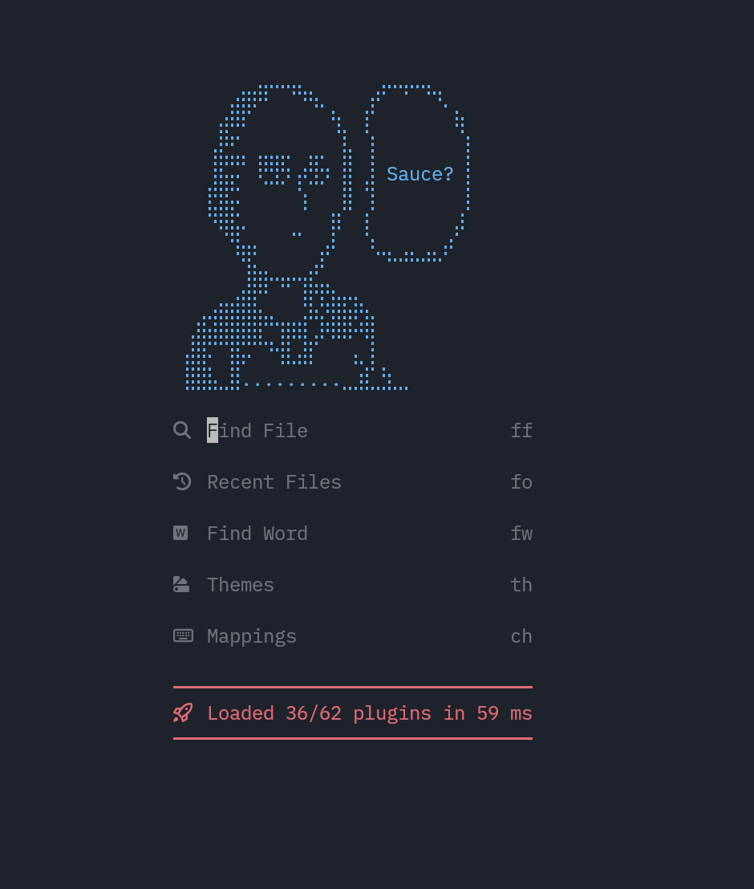

# My Neovim config

<a href="https://dotfyle.com/ratataque/neovimconfig"></a>
<a href="https://dotfyle.com/ratataque/neovimconfig"></a>
<a href="https://dotfyle.com/ratataque/neovimconfig"></a>



## Install Instructions

> Install requires Neovim 0.11+. Always review the code before installing a configuration.

Clone the repository and install the plugins:

```sh
git clone git@github.com:ratataque/neovim_config ~/.config/nvim
```

## Plugins

### comment

- [danymat/neogen](https://dotfyle.com/plugins/danymat/neogen)

### completion

- [Saghen/blink.cmp](https://github.com/Saghen/blink.cmp)

### diagnostics

- [folke/trouble.nvim](https://dotfyle.com/plugins/folke/trouble.nvim)

### editing-support

- [Wansmer/treesj](https://dotfyle.com/plugins/Wansmer/treesj)
- [debugloop/telescope-undo.nvim](https://dotfyle.com/plugins/debugloop/telescope-undo.nvim)
- [windwp/nvim-ts-autotag](https://dotfyle.com/plugins/windwp/nvim-ts-autotag)

### file-explorer

- [nvim-tree/nvim-tree.lua](https://dotfyle.com/plugins/nvim-tree/nvim-tree.lua)
- [yazi](https://github.com/mikavilpas/yazi.nvim)

### formatting

- [stevearc/conform.nvim](https://dotfyle.com/plugins/stevearc/conform.nvim)

### fuzzy-finder

- [nvim-telescope/telescope.nvim](https://dotfyle.com/plugins/nvim-telescope/telescope.nvim)
- [ibhagwan/fzf-lua](https://dotfyle.com/plugins/ibhagwan/fzf-lua)

### game

- [ThePrimeagen/vim-be-good](https://dotfyle.com/plugins/ThePrimeagen/vim-be-good)

### git

- [kdheepak/lazygit.nvim](https://dotfyle.com/plugins/kdheepak/lazygit.nvim)

### github

- [pwntester/octo.nvim](https://dotfyle.com/plugins/pwntester/octo.nvim)

### icon

- [nvim-tree/nvim-web-devicons](https://dotfyle.com/plugins/nvim-tree/nvim-web-devicons)

### lsp

- [smjonas/inc-rename.nvim](https://dotfyle.com/plugins/smjonas/inc-rename.nvim)
- [jose-elias-alvarez/null-ls.nvim](https://dotfyle.com/plugins/jose-elias-alvarez/null-ls.nvim)
- [neovim/nvim-lspconfig](https://dotfyle.com/plugins/neovim/nvim-lspconfig)

### lsp-installer

- [williamboman/mason.nvim](https://dotfyle.com/plugins/williamboman/mason.nvim)

### markdown-and-latex

- [iamcco/markdown-preview.nvim](https://dotfyle.com/plugins/iamcco/markdown-preview.nvim)

### marks

- [ratataque/harpoon](https://dotfyle.com/ratataque/ThePrimeagen/harpoon)

### motion

- [ggandor/leap.nvim](https://dotfyle.com/plugins/ggandor/leap.nvim)
- [folke/flash.nvim](https://dotfyle.com/plugins/folke/flash.nvim)

### nvim-dev

- [nvim-lua/plenary.nvim](https://dotfyle.com/plugins/nvim-lua/plenary.nvim)

### search

- [AckslD/muren.nvim](https://dotfyle.com/plugins/AckslD/muren.nvim)

### session

- [rmagatti/auto-session](https://github.com/rmagatti/auto-session)

### syntax

- [kylechui/nvim-surround](https://dotfyle.com/plugins/kylechui/nvim-surround)
- [nvim-treesitter/nvim-treesitter](https://dotfyle.com/plugins/nvim-treesitter/nvim-treesitter)

This readme was generated by [Dotfyle](https://dotfyle.com)
